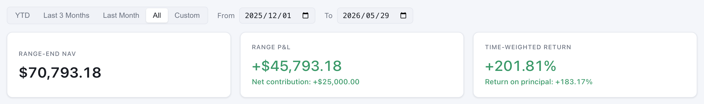
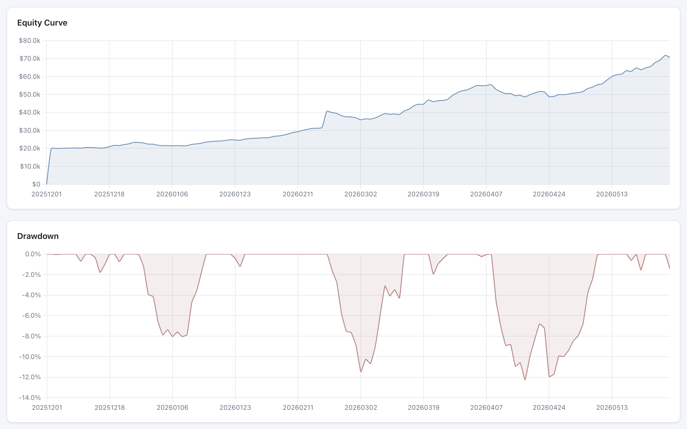
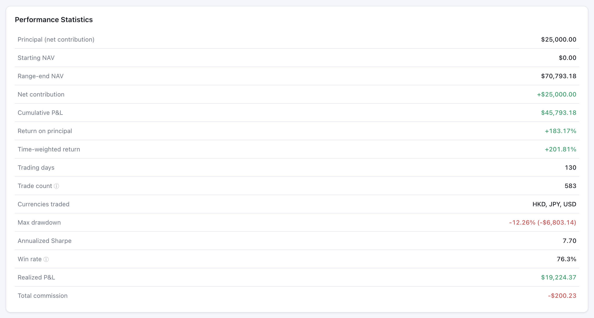
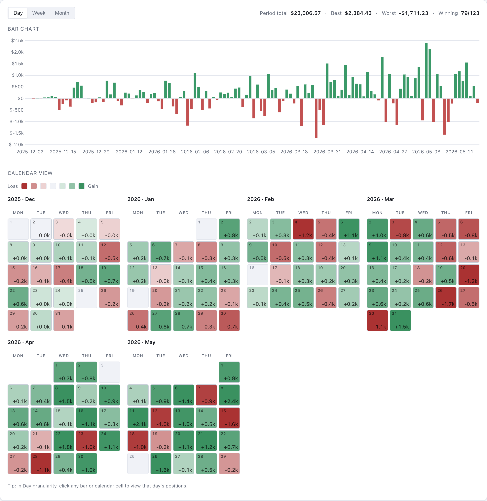
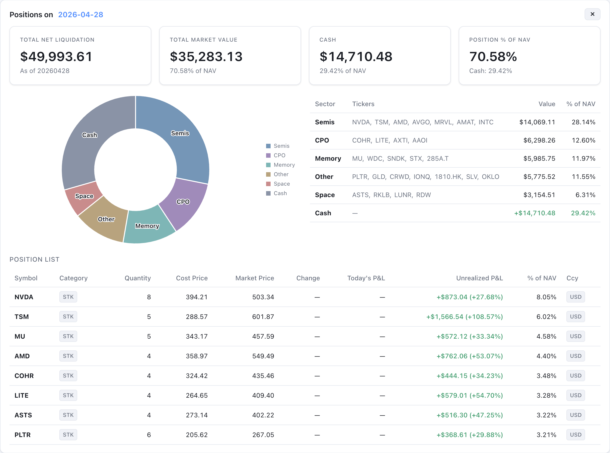
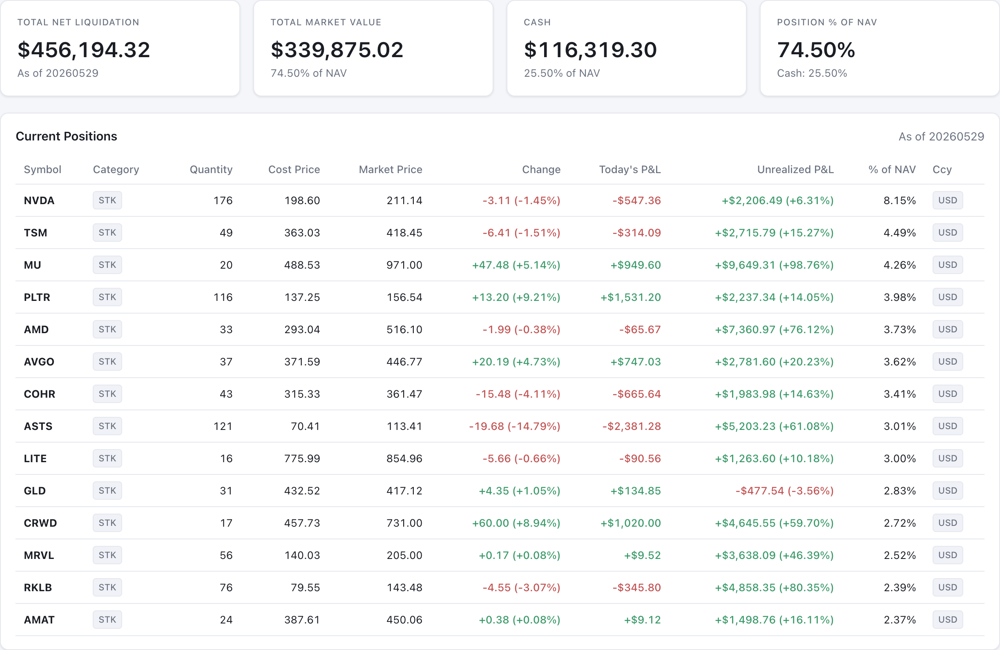
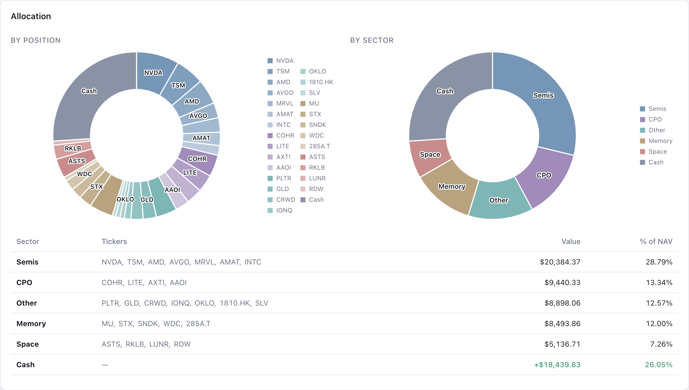
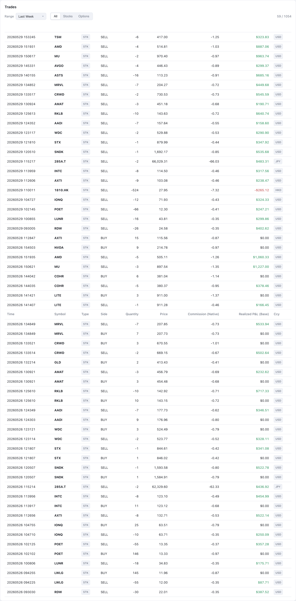
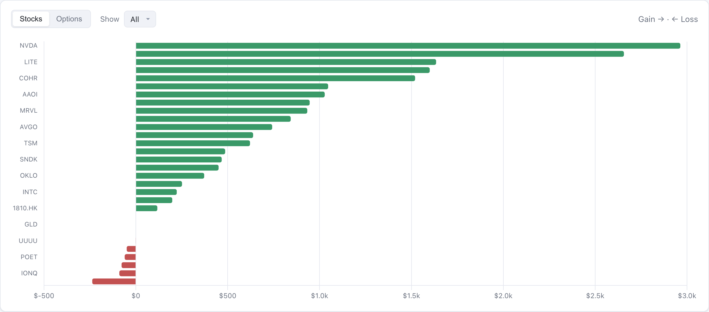
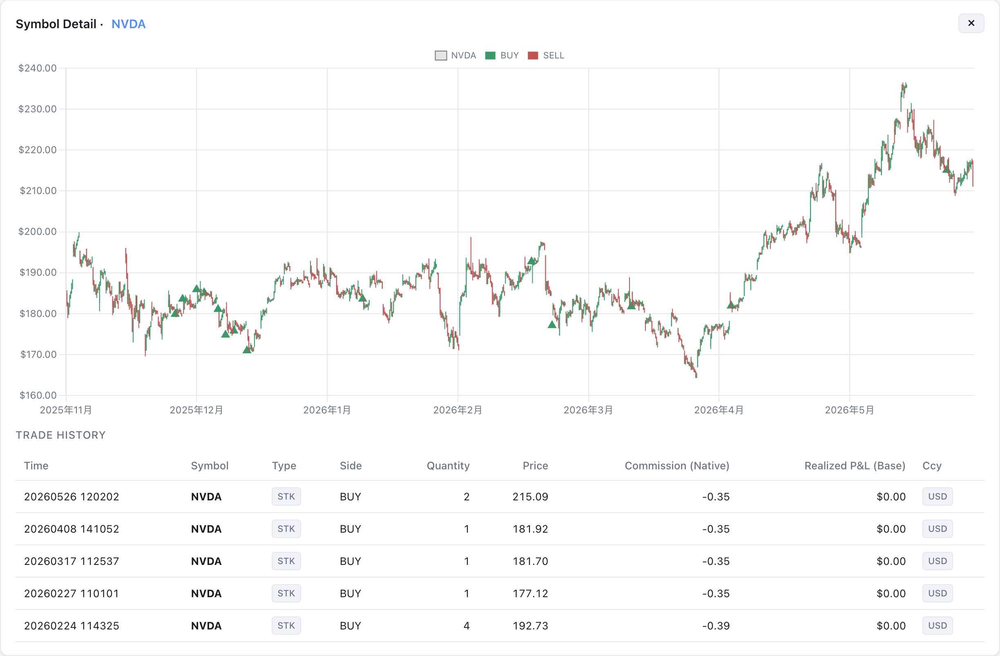

# IBKR Dashboard

A **local-only** dashboard for Interactive Brokers (IBKR) accounts. Pulls account
activity via IBKR's **Flex Web Service** (no TWS / IB Gateway required), enriches
it with **Yahoo Finance** price history (cached locally), and renders it as an
interactive dashboard served on `localhost`.

Everything — data, analysis, dashboard — stays on your machine. The HTTP server
binds to `127.0.0.1` only.

> 📊 **The screenshots below use anonymized demo data, not a real account.** All
> figures are generated for illustration only — not investment advice.

## Features

### Equity tab







- Date-range selector: **YTD / Last 3 Months / Last Month / All / Custom** (with date inputs)
- 3 KPI cards: **Range-end NAV**, **Range P&L** (with net contribution),
  **Time-weighted return** (with return-on-principal)
- Equity curve + drawdown (low-saturation palette)
- Full performance statistics: **Principal (net contribution)**, starting NAV,
  cumulative P&L, **return on principal**, **time-weighted return**, drawdown,
  Sharpe, win rate, realized P&L, commissions, currencies traded
- **Deposits / withdrawals are excluded** from P&L, returns and contribution — a
  mid-period top-up/withdrawal in the demo does not show up as a gain or loss

### Daily P&L tab



- Bar chart + traditional month-by-month calendar heatmap, always side-by-side
- Granularity toggle: **Day / Week / Month**
- Day view skips weekends; 4 months per row; colors range from eggshell-red
  (small loss) → deep red (big loss), symmetric green for gains
- **Click any bar or calendar cell** → expands a panel below with:
  - Account KPIs **for that date** (historical NLV / Market Value / Cash / Position %)
  - Sector allocation pie + table **for that date**
  - Full position list **for that date** (same columns as Positions tab)


<sub>↑ Demo data. Clicking a date expands that day's snapshot — KPIs, sector pie, and the positions held on that exact date (list truncated here).</sub>

### Positions tab


<sub>↑ Demo data. 74% invested with a positive cash buffer (no margin); top holdings shown (list truncated).</sub>

- 4 KPI cards: Total NLV / Market Value / Cash / Position % of NAV (with
  negative-cash margin warning)
- Per-position table:
  - Today's price change with % (auto-colored)
  - Today's P&L in base currency
  - Unrealized P&L in base currency + % vs cost
  - % of NAV per position
- Two allocation doughnuts side-by-side:
  - **By Position** — every ticker as its own slice, sector-color-grouped, tickers
    labeled inline on the ring (datalabels plugin)
  - **By Sector** — merged into sectors, with sector names on slices


<sub>↑ Demo data. The two doughnuts + the per-sector table (4 named sectors + Other + cash).</sub>

### Trades tab


<sub>↑ Demo data. Filtered to the last week (the count shows N / total); note the JPY fill on 285A.T.</sub>

- Time-window filter via dropdown (Last Day / Week / Month / 3 Months / YTD)
- Category filter (All / Stocks / Options)
- Every execution in one place; client-side filter, no re-pull needed

### By Symbol tab


<sub>↑ Demo data. Realized P&L per symbol — winners extend right, the few cut losers sit left.</sub>

- **Diverging Top-N chart** — gains right, losses left, sorted by impact
  (smallest loss on top, biggest loss pinned at bottom)
- Toggle between Stocks vs Options; toggle Top 5 / 10 / All
- "All Symbols" table with Stocks/Options/All filter
- **Click any bar or table row** → opens a Symbol Detail panel below:
  - **Candlestick chart** with hourly (or 5-minute) OHLC from Yahoo Finance
  - **Auto-fit time window**: zooms to the trade range with 15% padding,
    and auto-selects **5m** candles if the window fits in 60 days, else **1h**
  - **Your buy/sell markers** plotted directly on the chart (green ↑ for buys,
    red ↓ for sells, at your actual fill price)
  - Full trade history for that ticker (options auto-grouped to underlying)


<sub>↑ Demo data. Clicking a symbol opens its candlestick with your buy/sell markers + trade history (truncated here).</sub>

### Cross-cutting
- **i18n** — English / Chinese toggle, persisted in localStorage
- **Light / Dark themes** — toggle in top-right, persisted
- **Multi-currency aware** — JPY / HKD / USD positions and trades normalized to
  base currency via per-row `fxRateToBase`; native amounts shown alongside
- **Multi-account** — NAV, daily P&L, drawdown all summed across accounts by
  date (dedup key is `(accountId, reportDate)`)
- **No-cache server** — change any frontend file, just hit refresh

## Requirements

- Python 3.8+ (standard library only — no `pip install`)
- An Interactive Brokers account
- A modern browser
- Internet (for the Yahoo price fetch step; everything else is local)

## Setup

### 1. Create an Activity Flex Query in IBKR

1. Log into **Client Portal** → menu → **Performance & Reports → Flex Queries**
2. Next to **Activity Flex Query**, click **+** to create a new one
3. Name it (e.g., `daily_activity`) and enable these **Sections** (exact labels
   as they appear in the IBKR UI):

   | Section | What the dashboard does with it |
   |---|---|
   | **Trades** | Required. Use Execution-level. Include `Symbol, Asset Class, Trade Date/Time, Buy/Sell, Quantity, Trade Price, IB Commission, Net Cash, FX Rate To Base`, and **`Realized P/L`** (FIFO P/L Realized). Drives the Trades tab, By Symbol tab, win rate, realized P&L. |
   | **Net Asset Value (NAV) in Base** | Required. Parsed as `EquitySummaryInBase`. Drives the Equity Curve, daily P&L series, Today's P&L card, drawdown, Sharpe, and the per-date Cash / Market Value / Position % KPIs. |
   | **Change in NAV** | Recommended. Per-day P&L decomposition (starting/ending, realized, MTM, deposits & withdrawals). Used as a fallback for the equity series and visible in the Notes tab. |
   | **Open Positions** | Required. Drives the Positions tab, the sector pies, and the Daily-P&L click-through (positions on any historical date). |
   | **Cash Transactions** | Recommended. Supplies **dated** Deposits/Withdrawals so capital flows can be attributed to the right day and excluded from P&L (instead of just a period total). |
   | **Transfers** | Recommended. Dated cash/asset transfers, handled the same way as deposits/withdrawals. |

4. **General Configuration** — these settings make the parser work correctly
   (matches the format ibkr_flex_pull.py expects):

   | Setting | Value |
   |---|---|
   | Format | **XML** |
   | Period | **Year to Date** (recommended for first pull / general use; `Last 30 Days` is fine for ongoing daily refresh) |
   | Date Format | `yyyyMMdd` |
   | Time Format | `HHmmss` |
   | Date/Time Separator | single-space (`' '`) |
   | Profit and Loss | Default |
   | Include Currency Rates? | No (the dashboard uses each row's `fxRateToBase` instead) |
   | Display Account Alias in Place of Account ID? | **No** (the multi-account dedup keys use `accountId`) |
   | **Breakout by Day?** | **Yes** ← critical: without this, `Net Asset Value (NAV) in Base` and `Open Positions` collapse to a single row per period instead of per-day rows. |

5. Save and copy the **Query ID** (a number, usually 7 digits).

### 2. Generate a Flex Web Service token

1. **Client Portal** → **Performance & Reports** → **Flex Queries**
2. Find **Flex Web Service Configuration**, enable it, generate a token
3. Copy the token (a long number). Tokens expire (max ~1 year) — re-generate when needed

### 3. Configure locally

```bash
git clone git@github.com:Michaelwyx/IBKR-dashboard.git
cd IBKR-dashboard
cp config.example.json config.json
cp sectors.example.json sectors.json
```

Edit `config.json`:

```json
{
  "token": "<your_token>",
  "queries": { "activity": "<your_query_id>" },
  "output_dir": "./data"
}
```

> The token is **read-only** — it can pull statements but cannot trade or transfer
> funds. Still, treat it as a secret; `config.json` is in `.gitignore`.

Alternatively use an env var (safer): set `"token": "env:IBKR_FLEX_TOKEN"` and
`export IBKR_FLEX_TOKEN=...` in your shell.

### 4. Customize sectors

`sectors.json` maps tickers to sectors used in the Positions allocation pies and
the Daily P&L day-card. **Edit it for your portfolio.** Tickers not listed fall
into "Other". Option OCC symbols auto-resolve to their underlying.

### 5. Run

```bash
./run_daily.sh        # pull from IBKR → metrics → Yahoo prices → build dashboard
./serve.sh start      # start local server on http://localhost:8765 + open browser
```

After the first run, just `./run_daily.sh` daily (or whenever); the server stays
up and serves no-cache, so a normal browser refresh shows new data immediately.

## Daily pipeline (run_daily.sh)

```
[1/4]  ibkr_flex_pull.py   IBKR Flex → data/raw + data/*_cumulative.csv
[2/4]  analytics.py        cumulative CSVs → data/metrics.json
[3/4]  fetch_prices.py     Yahoo → site/data/prices/<TICKER>{,.5m}.json
[4/4]  build_site.py       metrics.json → site/data/dashboard.json
```

Step 3 fetches **two intervals per symbol**: `1h × 2y` (default file, ~250 KB)
and `5m × 60 d` (`.5m.json`, ~500 KB). Cache window is 4 hours; re-running
within that window skips. Use `--force` to ignore cache.

## Repo layout

```
IBKR-dashboard/
├── ibkr_flex_pull.py        # IBKR Flex pull (raw XML + parsed CSVs)
├── analytics.py             # metrics + sector breakdown + positionsByDate
├── fetch_prices.py          # Yahoo 1h × 2y + 5m × 60d → site/data/prices/
├── build_site.py            # bundle metrics into site/data/dashboard.json
├── run_daily.sh             # orchestrator (4-step pipeline above)
├── serve.py / serve.sh      # localhost-only no-cache static server
├── reset_cumulative.sh      # nuke accumulated CSVs (for re-pull after schema change)
├── config.example.json      # template — copy to config.json
├── sectors.json             # ticker → sector mapping
└── site/                    # static dashboard
    ├── index.html
    └── assets/{app.js, style.css}
```

Generated at runtime (gitignored):
```
├── config.json              # your token + query ID
├── data/                    # raw XML, per-section CSVs, accumulated CSVs, metrics.json
├── site/data/dashboard.json # what the dashboard fetches
├── site/data/prices/        # Yahoo OHLC cache, one file per ticker per interval
└── logs/                    # daily pipeline logs
```

## Command reference

| Command | What it does |
|---|---|
| `./run_daily.sh` | Pull → analyze → fetch prices → build (full refresh) |
| `./run_daily.sh --no-pull` | Skip IBKR pull (re-analyze + rebuild only) |
| `./serve.sh start` | Start dashboard server on localhost:8765, open browser |
| `./serve.sh stop/restart/status/fg` | Manage server |
| `./reset_cumulative.sh` | Delete accumulated CSVs and prompt for re-pull |
| `python3 ibkr_flex_pull.py` | Just pull from IBKR |
| `python3 analytics.py -c config.json` | Just compute metrics |
| `python3 fetch_prices.py` | Default: refresh all symbols at 1h + 5m |
| `python3 fetch_prices.py --symbols INTC NVDA --force` | Force-refresh specific symbols |
| `python3 fetch_prices.py --symbols X --interval 1m --range 7d` | One-off interval (e.g., 1m × 7d) |
| `python3 build_site.py` | Just rebuild `site/data/dashboard.json` |

## How drill-throughs work

### Daily P&L → date click
- `analytics.py` emits `positionsByDate: {YYYYMMDD: [enriched positions]}` and
  `accountSummaryByDate: {YYYYMMDD: {nlv, cash, marketValue, ...}}` for **every**
  reported day, so the frontend can render any historical day instantly without
  re-querying.

### By Symbol → ticker click
- Frontend computes the trade-time window first (earliest → latest trade + 15% pad)
- If window ≤ 58 days → fetches `<TICKER>.5m.json` (5m × 60d)
- Else → falls back to `<TICKER>.json` (1h × 2y)
- Buy/sell scatter overlay uses each trade's `dateTime` and `tradePrice`
- Option trades automatically appear under their underlying (e.g., ASTS calls
  show up on the ASTS chart)

## How history works (Flex Query date range)

IBKR's Flex Web Service has no date-range parameter — the date window is baked
into the saved Flex Query. So:

- `Last Business Day` → 1 day per pull
- `Last 30 Days` → 30 days per pull (recommended for ongoing use)
- `Year to Date` → entire YTD per pull (great for first-time backfill)

The dedup keys for accumulated tables are `(accountId, reportDate)` for NAV and
`(accountId, toDate)` for ChangeInNAV, so re-pulling overlapping windows
doesn't duplicate rows; trades dedup by `tradeID`.

If you change the Query's Date Period after pulling once, run
`./reset_cumulative.sh && ./run_daily.sh` to rebuild from scratch.

## Methodology notes

- **Realized P&L / commission / win rate**: aggregated in base currency via each
  trade's `fxRateToBase`. The Notes tab surfaces this when multi-currency is
  detected.
- **Win rate / avg win / avg loss**: based on closing trades only (trades that
  carry a non-zero realized P&L); opening trades don't have a P&L yet.
- **Capital flows**: deposits / withdrawals / transfers are dated from
  `CashTransactions` + `Transfers` (falling back to `ChangeInNAV`) and **excluded**
  from daily P&L, cumulative P&L, return-on-principal and time-weighted return.
  Principal = total inflows − outflows; starting NAV is reported separately.
- **Drawdown / Sharpe**: based on the NAV time series summed across accounts.
- **Today's P&L** (per position): `(mark_today − mark_yesterday) × position × fx`.
  Computed from two consecutive `OpenPositions` snapshots; needs ≥ 2 days of data.
- **Positions sector**: comes from `sectors.json` (manual mapping). Unknown
  tickers go to "Other". Options use their underlying.

## Daily / scheduled runs

No scheduler is registered by default. Add cron / launchd / Task Scheduler if you want:

**cron** (Linux/macOS):
```cron
0 8 * * 1-5  /path/to/IBKR-dashboard/run_daily.sh >> /path/to/IBKR-dashboard/logs/cron.log 2>&1
```

**launchd** (macOS) — `~/Library/LaunchAgents/com.user.ibkr-daily.plist`:
```xml
<?xml version="1.0" encoding="UTF-8"?>
<!DOCTYPE plist PUBLIC "-//Apple//DTD PLIST 1.0//EN" "http://www.apple.com/DTDs/PropertyList-1.0.dtd">
<plist version="1.0">
<dict>
  <key>Label</key><string>com.user.ibkr-daily</string>
  <key>ProgramArguments</key>
  <array><string>/path/to/IBKR-dashboard/run_daily.sh</string></array>
  <key>StartCalendarInterval</key>
  <dict><key>Hour</key><integer>8</integer><key>Minute</key><integer>0</integer></dict>
  <key>StandardOutPath</key><string>/path/to/IBKR-dashboard/logs/launchd.out.log</string>
  <key>StandardErrorPath</key><string>/path/to/IBKR-dashboard/logs/launchd.err.log</string>
</dict>
</plist>
```
Load: `launchctl load ~/Library/LaunchAgents/com.user.ibkr-daily.plist`

## Common pitfalls

| Symptom | Likely cause |
|---|---|
| `ErrorCode=1003` | Token invalid or expired |
| `ErrorCode=1006` | Wrong Query ID, or query not saved |
| `ErrorCode=1019` repeating | IBKR is generating the statement — script retries |
| Dashboard says "no positions" | Open Positions section not enabled in Flex Query |
| Multi-currency totals look wrong | `FX Rate To Base` field missing in Trades — add it |
| "No prices cached" on a symbol | Yahoo doesn't have it under that exact symbol (e.g., JP stock needs `.T` suffix). Try `python3 fetch_prices.py --symbols MYTICKER.T --force` |
| Candlestick chart too zoomed out | Working as designed — auto-fits to your trade range with 15% padding |
| Want minute-level zoom | `python3 fetch_prices.py --symbols X --interval 1m --range 7d` (manual one-off) |

## Privacy

- HTTP server binds to `127.0.0.1` only — not reachable from your LAN
- Chart.js / candlestick / datalabels / luxon-adapter are loaded from CDN. For
  fully offline operation, download these into `site/assets/` and update the
  `<script>` tags in `index.html`.
- Yahoo Finance is the only outbound network call after initial page load
  (during `fetch_prices.py`); the dashboard itself reads from your local disk.

## Credits

Template by Yixuan Wang. Data flows are 100% IBKR Flex Web Service + Yahoo Finance.
